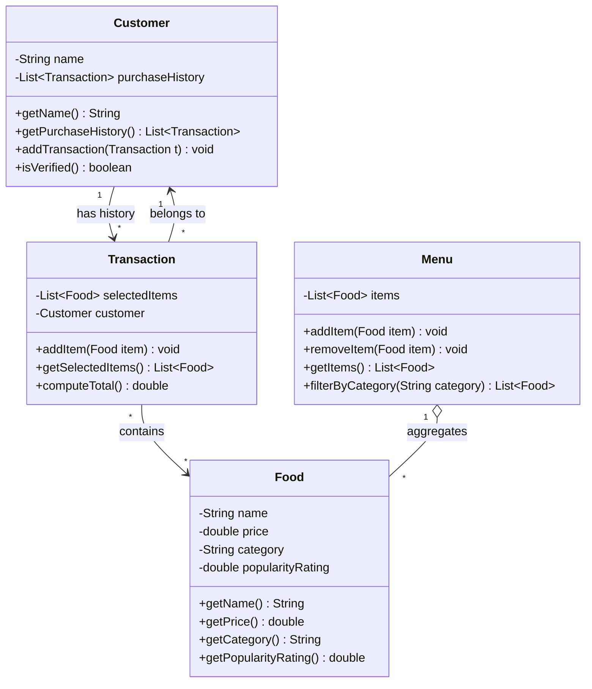

# ByteBites — UML Class Diagram Draft

## How the spec maps to the design

| Class | Responsibility (from request) | Key members |
|-------|------------------------------|-------------|
| **Customer** | Track name + past purchases; verify a real user | `name`, `purchaseHistory: List<Transaction>`, `isVerified()` |
| **Food** | A single sellable item | `name`, `price`, `category`, `popularityRating` |
| **Menu** | Full collection of items; filter by category | `items: List<Food>`, `filterByCategory()` |
| **Transaction** | Group picked items; compute total | `selectedItems: List<Food>`, `computeTotal()` |

## Relationship rationale

- **Customer → Transaction** (1-to-many): purchase history is a list of past transactions, which also backs `isVerified()`.
- **Transaction → Food** (many-to-many): a transaction holds the selected items; `computeTotal()` sums their `price`.
- **Menu ◇— Food** (aggregation): the menu *holds* the full catalog of items but doesn't own their lifecycle.
